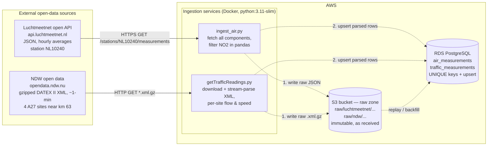
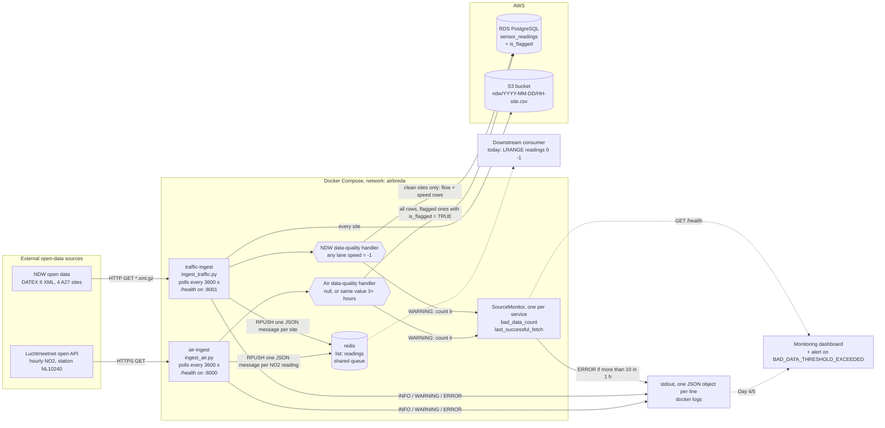
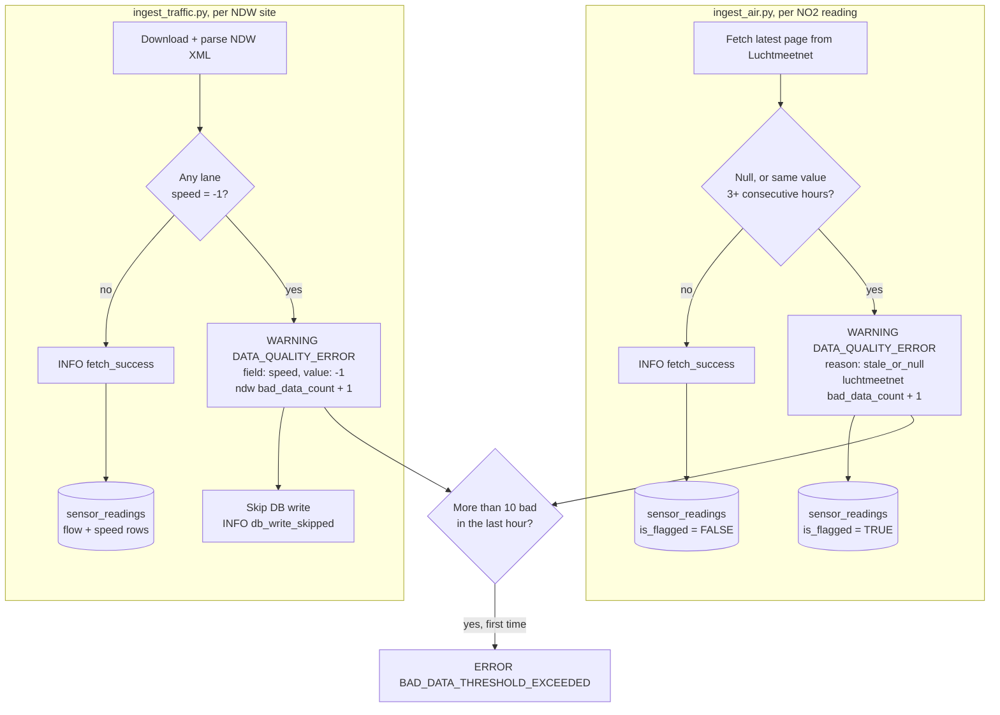
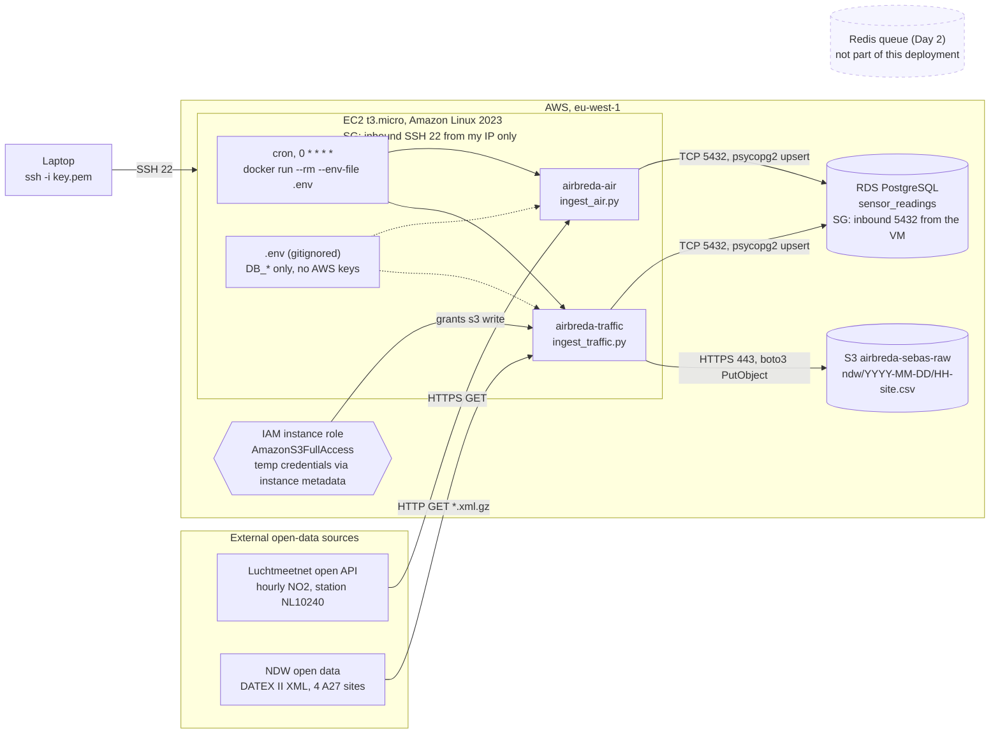
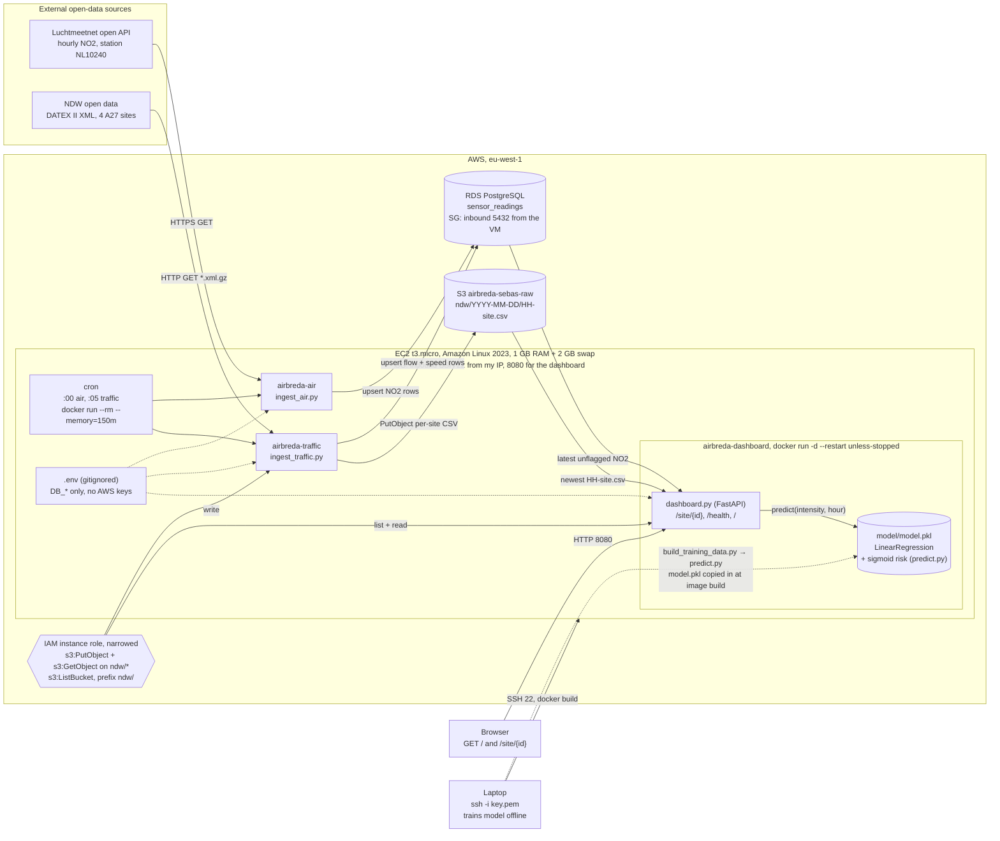

# AirBreda — Architecture Design Document
## 1. Architecture diagram (Checkpoint 1)

Captures the understanding at Checkpoint 1, kept for reference. The current
system is in [Checkpoint 4](#4-architecture-diagram-checkpoint-4--full-airbreda-architecture).
Solid lines existed in the repo at the time. Dashed lines were designed but not yet built.

### Components

| Component | Role | Status |
|---|---|---|
| Luchtmeetnet API | Source of NO2 (and PM2.5, PM10, NO) for NL10240. Hourly averages stamped at the *end* of the hour. No API key; fair use is 100 req / 5 min. | External |
| NDW open data | Source of A27 traffic flow (veh/h) and speed (km/h). Full-country files, so only 4 site IDs are extracted. | External |
| `ingest_air.py` | Air-quality ingestion. Containerised by `Dockerfile.air` (image `airbreda-air`). | Built, see Checkpoint 2 |
| `ingest_traffic.py` (uses `getTrafficReadings.py`) | Traffic ingestion. Containerised by `Dockerfile.traffic` (image `airbreda-traffic`). | Built, see Checkpoint 2 |
| S3 bucket | Archive of the per-site traffic CSVs. | Built for traffic only |
| RDS PostgreSQL | Stores cleaned, typed, deduplicated readings for querying and joining. | Built (single `sensor_readings` table) |

### Planned data flow per run

1. Fetch from the source.
2. Write the untouched payload to S3 under a time-partitioned key, e.g.
   `raw/luchtmeetnet/station=NL10240/date=2026-09-29/fetched_at=155242Z.json`.
3. Parse and validate, then upsert into PostgreSQL.
4. If step 3 fails, the raw file is still in S3 and can be replayed later.

## 2. Architecture diagram (Checkpoint 2 — Patterns & Resilience)

The local Day 2 setup, kept for reference: `docker compose up` starts three
containers on one `airbreda` network, and the two ingestion services write
to AWS. The deployed system is in [Checkpoint 4](#4-architecture-diagram-checkpoint-4--full-airbreda-architecture).

Solid lines are built and have been run. Dashed lines are planned: nothing
consumes the queue yet, and the dashboard is wired up in Day 4/5.

### Structured logging path

Both scripts log through Python's `logging` module. `observability.py`
formats every record as one JSON object on stdout, adding `level` and
`logged_at`, so `docker logs` today (and a dashboard later) can filter on
fields instead of parsing text.

| Level | Event | Logged by | When |
|---|---|---|---|
| INFO | `fetch_success` | air: per clean NO2 reading; traffic: per clean site | Reading passed the data-quality check |
| INFO | `db_write`, `redis_publish`, `s3_upload` | both (S3: traffic only) | A sink write succeeded; includes row/message counts |
| INFO | `db_write_skipped` | traffic | Site had speed = -1, so no database write |
| WARNING | `DATA_QUALITY_ERROR` | both | Air: null or stale value. NDW: speed = -1 |
| WARNING | `fetch_empty` | both | Source answered but returned no readings |
| ERROR | `BAD_DATA_THRESHOLD_EXCEEDED` | both, via `SourceMonitor` | More than 10 bad readings for one source within an hour; logged once per breach |
| ERROR | `fetch_failed`, `db_write_failed`, `redis_publish_failed`, `s3_upload_failed`, `run_failed` | both | A source or sink failed. The poll loop keeps running |

### Data-quality handler path

Why the two sources are handled differently:

- **Air readings are kept and flagged.** A gap in the NO2 series is worse
  than a flagged value. The analysis can exclude or impute flagged rows, but
  it can't recover a dropped hour. A value only looks stale once its third
  repeat arrives, so the upsert also sets `is_flagged` on the earlier,
  already-stored rows (it never clears it). Each reading is logged and
  counted once, even though every poll fetches it again.
- **NDW -1 readings are skipped.** -1 is a sentinel meaning "no valid
  speed", not a measurement, and storing it would corrupt averages. The site
  still goes to S3 and Redis, whose `avg_speed` already excludes the -1
  lanes. The next poll fetches a fresh reading, so a skipped hour costs less
  than a missing air hour.

### Changes since Checkpoint 1

- **One table, not two:** `sensor_readings` holds both sources (`component`
  = `NO2`, `flow`, `speed`), with `is_flagged BOOLEAN DEFAULT FALSE`.
  `station_id` was widened to `VARCHAR(40)` for the 27-character NDW site IDs.
- **Upserts differ by source:** air uses `ON CONFLICT ... DO UPDATE SET
  is_flagged = TRUE` (only ever upgrades the flag), traffic uses `ON CONFLICT
  DO NOTHING`. Neither overwrites a stored value.
- **S3 holds parsed CSVs, not raw payloads,** and only for traffic. The
  raw-zone design from Checkpoint 1 (raw JSON / `.xml.gz`) isn't built yet.
- **Added:** the Redis queue, JSON logging, data-quality handlers and
  `/health` endpoints.

## 3. Architecture diagram (Checkpoint 3 — DataLab State)

The Day 3 deployment, kept for reference: one EC2 VM runs both ingestion
images on an hourly cron schedule, and each container writes straight to RDS
and S3. The Day 2 queue is not deployed. The full system is in
[Checkpoint 4](#4-architecture-diagram-checkpoint-4--full-airbreda-architecture).

### Changes since Checkpoint 2

- **Laptop to VM:** the containers run on an EC2 instance instead of Docker
  Desktop, so ingestion keeps going when the laptop is closed. Docker was
  installed by hand (IaaS: the OS and runtime are ours to maintain).
- **Scheduling:** cron starts a fresh container each hour (`--rm`) instead of
  a long-running `docker compose` service. `docker-compose.yml` was not copied
  to the VM.
- **No queue:** ingestion writes directly to RDS and S3. With one VM, hourly
  runs and no second consumer, a broker only adds something to run and
  monitor. It comes back once there is more than one consumer or more than one VM.
- **Credentials:** S3 access comes from the IAM instance role, not from AWS
  keys copied into `.env`. The DB password lives only in the gitignored
  `.env`, never in the `docker run` command or shell history.
- **Network:** the RDS security group now allows the VM, not only my laptop's
  IP. S3 is reached over HTTPS through the VM's public internet route.

## 4. Architecture diagram (Checkpoint 4 — Full AirBreda Architecture)

The complete system: three containers on one EC2 VM. The two ingestion jobs
fill RDS and S3 every hour, and the dashboard reads both back and adds a
prediction from the model baked into its image. The same three images also
run on-prem with `docker compose up` (see [Local mirror](#local-mirror-docker-compose)).

Solid lines run every hour (ingestion) or on every request (dashboard). The
dashed line runs only when the model is retrained, which is a manual step.

### Components

| Component | Role | Runs as |
|---|---|---|
| `airbreda-air` | Fetches NO2 for NL10240, flags null/stale values, upserts into RDS. | cron at :00, `--rm`, 150 MB cap |
| `airbreda-traffic` | Downloads the NDW file, extracts the 4 A27 sites, upserts into RDS and uploads one CSV per site to S3. | cron at :05, `--rm`, 150 MB cap |
| `airbreda-dashboard` | `/site/{id}` combines the latest NO2 (RDS), the site's latest intensity (S3) and `predict()`. `/` is an HTML page that calls `/site/{id}` for each site. | `-d --restart unless-stopped`, port 8080 |
| `model.pkl` | LinearRegression on `total_intensity_veh_per_hr` + `hour_of_day`. Risk is a sigmoid around 40 µg/m³ (ADR-006). | Read-only file inside the dashboard image |
| RDS PostgreSQL | Source of truth for parsed readings (`sensor_readings`, `is_flagged`). | Managed, SG allows only the VM |
| S3 bucket | Per-site traffic CSVs. Written by traffic ingestion, read by the dashboard. | Managed, reached via the instance role |

### Where the model lives and how the dashboard uses it

1. **Train offline (laptop):** `build_training_data.py` joins NO2 from RDS
   with traffic from S3 into `training_data.csv`. `predict.py` fits the model
   and writes `model/model.pkl`. `evaluate.py` and `tests/test_model.py`
   check it.
2. **Bake into the image:** `Dockerfile.dashboard` copies `model.pkl` next to
   `predict.py`, so the model and the code that builds its features ship
   (and roll back) as one image.
3. **Serve:** on each `/site/{id}` request, the dashboard rounds the S3
   timestamp to the hour in UTC, calls `predict()` and adds
   `no2_ug_m3_predicted` and `no2_exceedance_risk` to the response. If
   `predict()` fails, both fields are `null` and the measured values are
   still returned.

### Local mirror (Docker Compose)

`docker compose up` runs the same three images on the `airbreda` network,
plus the Day 2 Redis queue, against the same RDS and S3. The differences
from the VM: the ingest services poll in a loop instead of being started by
cron (so the dashboard's `/health` can reach them by service name), S3
access comes from AWS keys in `.env` instead of the instance role, and the
dashboard is on `localhost:8080`.

### Changes since Checkpoint 3

- **Added the dashboard container** on the same VM (ADR-005), with port 8080
  opened in the security group. It's the first long-running process on the VM.
- **Added the model:** trained offline, baked into the dashboard image,
  served through `predict()` (ADR-006).
- **Memory:** the 1 GB VM ran out of memory with three Python containers.
  Ingestion is now capped and staggered (:00 / :05), and a 2 GB swap file was
  added after the cap alone didn't stop the processes being killed.
- **Still open:** S3 holds parsed CSVs rather than raw payloads (ADR-001), the
  ingest containers' `/health` isn't reachable on the VM because they exit
  after each run, and the single VM doesn't yet meet ADR-003's Warm Standby.
