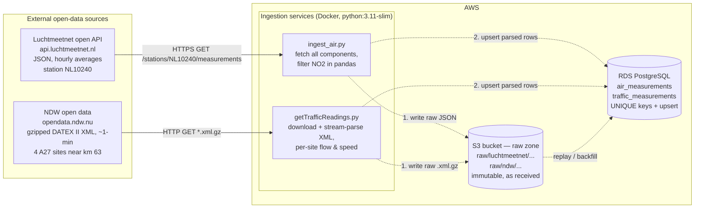
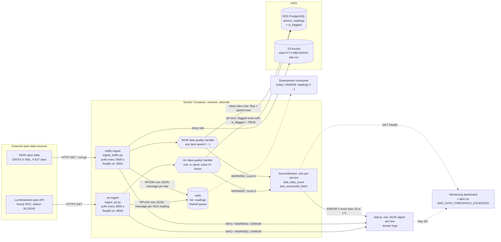
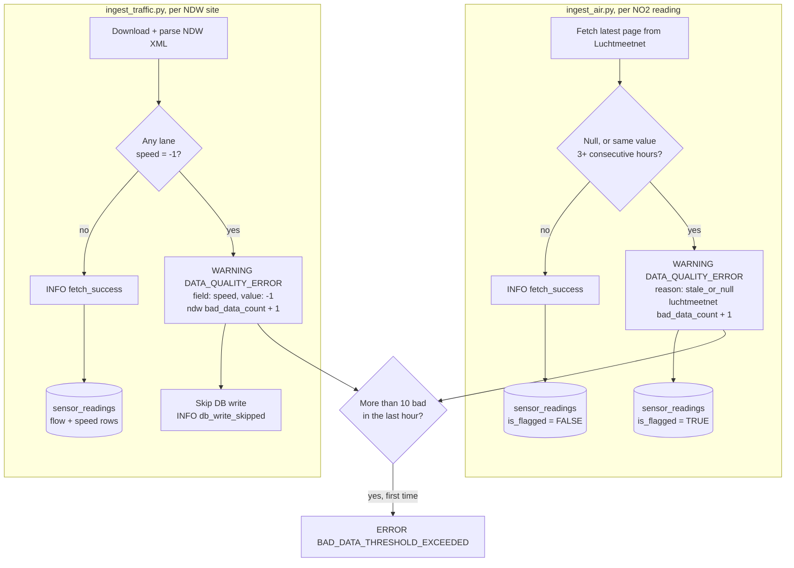

# AirBreda — Architecture Design Document
## 1. Architecture diagram (Checkpoint 1)

Captures the understanding at Checkpoint 1, kept for reference. The current
system is in [Checkpoint 2](#2-architecture-diagram-checkpoint-2--patterns--resilience).
Solid lines existed in the repo at the time. Dashed lines were designed but not yet built.

### Components

| Component | Role | Status |
|---|---|---|
| Luchtmeetnet API | Source of NO2 (and PM2.5, PM10, NO) for NL10240. Hourly averages stamped at the *end* of the hour. No API key; fair use is 100 req / 5 min. | External |
| NDW open data | Source of A27 traffic flow (veh/h) and speed (km/h). Full-country files, so only 4 site IDs are extracted. | External |
| `ingest_air.py` | Air-quality ingestion. Containerised by `Dockerfile.air` (image `airbreda-air`). | Built, see Checkpoint 2 |
| `ingest_traffic.py` (uses `getTrafficReadings.py`) | Traffic ingestion. Containerised by `Dockerfile.traffic` (image `airbreda-traffic`). | Built, see Checkpoint 2 |
| S3 bucket | Archive of the per-site traffic CSVs. | Built for traffic only |
| RDS PostgreSQL | Stores cleaned, typed, deduplicated readings for querying and joining. | Built (single `sensor_readings` table) |

### Planned data flow per run

1. Fetch from the source.
2. Write the untouched payload to S3 under a time-partitioned key, e.g.
   `raw/luchtmeetnet/station=NL10240/date=2026-09-29/fetched_at=155242Z.json`.
3. Parse and validate, then upsert into PostgreSQL.
4. If step 3 fails, the raw file is still in S3 and can be replayed later.

## 2. Architecture diagram (Checkpoint 2 — Patterns & Resilience)

What runs today: `docker compose up` starts three containers on one
`airbreda` network, and the two ingestion services write to AWS.

Solid lines are built and have been run. Dashed lines are planned: nothing
consumes the queue yet, and the dashboard is wired up in Day 4/5.

### Structured logging path

Both scripts log through Python's `logging` module. `observability.py`
formats every record as one JSON object on stdout, adding `level` and
`logged_at`, so `docker logs` today (and a dashboard later) can filter on
fields instead of parsing text.

| Level | Event | Logged by | When |
|---|---|---|---|
| INFO | `fetch_success` | air: per clean NO2 reading; traffic: per clean site | Reading passed the data-quality check |
| INFO | `db_write`, `redis_publish`, `s3_upload` | both (S3: traffic only) | A sink write succeeded; includes row/message counts |
| INFO | `db_write_skipped` | traffic | Site had speed = -1, so no database write |
| WARNING | `DATA_QUALITY_ERROR` | both | Air: null or stale value. NDW: speed = -1 |
| WARNING | `fetch_empty` | both | Source answered but returned no readings |
| ERROR | `BAD_DATA_THRESHOLD_EXCEEDED` | both, via `SourceMonitor` | More than 10 bad readings for one source within an hour; logged once per breach |
| ERROR | `fetch_failed`, `db_write_failed`, `redis_publish_failed`, `s3_upload_failed`, `run_failed` | both | A source or sink failed. The poll loop keeps running |

### Data-quality handler path

Why the two sources are handled differently:

- **Air readings are kept and flagged.** A gap in the NO2 series is worse
  than a flagged value. The analysis can exclude or impute flagged rows, but
  it can't recover a dropped hour. A value only looks stale once its third
  repeat arrives, so the upsert also sets `is_flagged` on the earlier,
  already-stored rows (it never clears it). Each reading is logged and
  counted once, even though every poll fetches it again.
- **NDW -1 readings are skipped.** -1 is a sentinel meaning "no valid
  speed", not a measurement, and storing it would corrupt averages. The site
  still goes to S3 and Redis, whose `avg_speed` already excludes the -1
  lanes. The next poll fetches a fresh reading, so a skipped hour costs less
  than a missing air hour.

### Changes since Checkpoint 1

- **One table, not two:** `sensor_readings` holds both sources (`component`
  = `NO2`, `flow`, `speed`), with `is_flagged BOOLEAN DEFAULT FALSE`.
  `station_id` was widened to `VARCHAR(40)` for the 27-character NDW site IDs.
- **Upserts differ by source:** air uses `ON CONFLICT ... DO UPDATE SET
  is_flagged = TRUE` (only ever upgrades the flag), traffic uses `ON CONFLICT
  DO NOTHING`. Neither overwrites a stored value.
- **S3 holds parsed CSVs, not raw payloads,** and only for traffic. The
  raw-zone design from Checkpoint 1 (raw JSON / `.xml.gz`) isn't built yet.
- **Added:** the Redis queue, JSON logging, data-quality handlers and
  `/health` endpoints.

